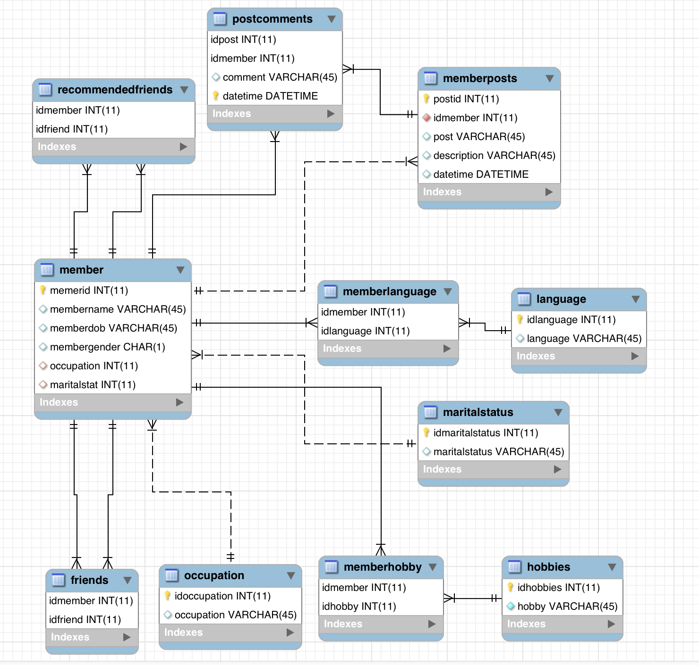

# Social Network
# Mini Project
# This is one of the mini projects that I prepared  for my  students in a Database Course 
Assume you are creating a database for a social network (e.g. Facebook). You are required to create tables that keep the following data for members of the social network. You need to keep data such as their name, date of birth, gender, marital status, hobbies, languages they speak, occupation. Make sure that each member can have more than one hobby and can speak more than one language.
You are required to keep track of which members are recommended to be friends with other members and which members are friends with other members.
Members will be able to post on the social network some pictures and write a description under each picture, the time and date of the posts should be saved. Friends will be able to write comments on their friend’s pictures and those comments will be saved in the database.
### Take into consideration the following:
 The languages spoken can be either 1 Arabic, 2 English, 3 French, 4 Spanish.
Gender is either M for male of F for female.
Marital status is either 1 married, 2 single, 3, divorced.
Occupation can be either 1 teacher, 2 engineer, 3 medical doctor, 4 accountant, 5 unemployed.
Hobbies can be either 11 for sports, 12 for video games, 13 knitting, 14 acting.

### Requirements:
-	Create an ERD for the above description.
-	Create a Database Schema.
-	Use any DBMS and create the “SocialNetwork” database and write SQL queries to answer the following.
1.	Select information of the female members.
2.	Select the information of the male members who don’t have friends yet.
3.	Select all the friends of member “x” who are less than 35 years old.
4.	Select the names of the friends of member “x” who are married.
5.	Select the names of the members who like sports and are recommended to member “x”.
6.	Select the names of the members who speak three languages.
7.	Select the names of the members who posted more than 4 posts.
8.	Select the names of the members who didn’t post posts today.
9.	Select the name of the members who made the most comments on his/her friends pictures.
10.	Select the name(s) of the member(s) who posted a picture that got the most comments.
11.	Select the names of the friends of your friend “y”.
12.	Select the “teacher” members who have a friend that likes “acting” and speaks “Spanish”.
13.	Select the count of posts posted by members of each of the occupation categories (ordered descending).
14.	Select the count of the members who speak each language (ordered ascending).
15.	Select the members that speak more than two languages.
16.	Select the members that have the most number of friends.
17.	Select the member that has the second most number of friends.
18.	Select the “doctor” members and like “video games”
19.	Select the members who are married and who speak “Spanish”.
20.	Delete the members recommended to “x” after she added them as friends.
21.	Select the count of posts posted by members of each gender (ordered descending).
22.	Select the names of the members along with their calculated ages, ordered descending.

# ERD:

